# Lesson 02: Open Source GIS and Data Management Tools – Introduction to QGIS and PostGIS

## Table of Contents
<!-- TOC depthFrom:1 depthTo:6 withLinks:1 updateOnSave:1 orderedList:0 -->

- [Lesson 02: Open Source GIS and Data Management Tools – Introduction to QGIS and PostGIS](#lesson-02-open-source-gis-and-data-management-tools-introduction-to-qgis-and-postgis)
	- [Table of Contents](#table-of-contents)
	- [Overview](#overview)
	- [Data files in our workflow](#data-files-in-our-workflow)
		- [Working with large file sizes and formats](#working-with-large-file-sizes-and-formats)
	- [What is cartography, mapping, and GIS?](#what-is-cartography-mapping-and-gis)
		- [Cartography: The art and science of mapmaking](#cartography-the-art-and-science-of-mapmaking)
		- [Geographic Information Systems (GIS): an "old" tool in a new web mapping world](#geographic-information-systems-gis-an-old-tool-in-a-new-web-mapping-world)
	- [QGIS: An open source solution for our GIS needs](#qgis-an-open-source-solution-for-our-gis-needs)
		- [Downloading and Installing QGIS](#downloading-and-installing-qgis)
		- [Bugs](#bugs)
	- [Getting Started with QGIS](#getting-started-with-qgis)
	- [A quick primer on geodesy and spatial reference systems](#a-quick-primer-on-geodesy-and-spatial-reference-systems)
	- [Understanding geographic data and data formats](#understanding-geographic-data-and-data-formats)
		- [Vector data](#vector-data)
		- [Raster data](#raster-data)
	- [Using vector data within QGIS](#using-vector-data-within-qgis)
		- [Loading and inspecting points, lines, and polygon Shapefiles in QGIS](#loading-and-inspecting-points-lines-and-polygon-shapefiles-in-qgis)
	- [Why is Kentucky squashed? Understanding coordinate systems in QGIS](#why-is-kentucky-squashed-understanding-coordinate-systems-in-qgis)
		- [Project all layers 'on the fly'](#project-all-layers-on-the-fly)
	- [Attribute management](#attribute-management)
		- [Filtering attributes in the QGIS Layers Panel](#filtering-attributes-in-the-qgis-layers-panel)
			- [Filtering wildcards](#filtering-wildcards)
		- [Spatial databases and the DB Manager](#spatial-databases-and-the-db-manager)
			- [Open source spatial databases](#open-source-spatial-databases)
			- [Install PostGIS and connect to database](#install-postgis-and-connect-to-database)
		- [QGIS's DB Manager](#qgiss-db-manager)
			- [Add data to DB Manager](#add-data-to-db-manager)
		- [Example SQL statements for this lesson](#example-sql-statements-for-this-lesson)
		- [SQL in the DB Manager](#sql-in-the-db-manager)
			- [Field data types](#field-data-types)
			- [CAST to other data types](#cast-to-other-data-types)
			- [WHERE clause wildcards](#where-clause-wildcards)
		- [Use Atom text editor to save and edit your SQL](#use-atom-text-editor-to-save-and-edit-your-sql)
		- [Exporting SQL query tables as layers in Map Canvas](#exporting-sql-query-tables-as-layers-in-map-canvas)
			- [Create three more layers](#create-three-more-layers)
			- [Selecting Kentucky state polygon](#selecting-kentucky-state-polygon)
			- [Selecting Kentucky waterbodies](#selecting-kentucky-waterbodies)
			- [Selecting Kentucky streams](#selecting-kentucky-streams)
	- [Converting layers to GeoJSON format with a projection transformation](#converting-layers-to-geojson-format-with-a-projection-transformation)
		- [Editing GeoJSON layers](#editing-geojson-layers)
	- [Resources and references](#resources-and-references)

<!-- /TOC -->

## Overview

Within this lesson you will:

* Gain a basic conceptual understanding of cartography, GIS, and mapping
* Gain familiarity with geographic data and information, and how it's encoded within computer files
* Download and install a free and open-source GIS applications (QGIS and PostGIS)
* Create and query a spatial database with SQL
* Gain a basic familiarity with the QGIS interface
* Gain awareness of spatial reference and projection issues
* Practice opening a variety of geographic data with QGIS and viewing their attributes within QGIS


## Data files in our workflow

Each module will contain data that you will use in your lesson and lab. Some are provide in the module's GitHub repo or on Canvas, some will be downloaded from other websites, and finally we will create new data. In most cases, we don't need to sync large datasets downloaded from the web in our repository. A common workflow is to create a folder outside of our repository to hold this data. Think of this data as redundant (we can always download it again) and instructions of how to handle this data as unique. We will write Structured Query Language (SQL) instructions that manage our data and save those in our repository.

### Working with large file sizes and formats

GIS data can have massive file sizes, so we need a strategy to manage these datasets in our repository. After you have followed the instructions below and extracted the files, check your GitHub Desktop client and notice that it hasn't registered changes to your repo, i.e., it doesn't recognize the .zip files! We have configured GitHub to ignore certain files to prevent us from committing and syncing them.

GitHub has a maximum size limit of 100 MB for a single file. If we have a file this size or larger in our repo and try to commit it, an error will occur. To prevent this error, we will ignore committing and syncing certain file formats that often balloon in size. Look at (but don't change) the _.gitignore_ file in each repo to find the formats we are ignoring. If you are working on multiple machines, you'll need to manage these files separately such as with Dropbox or Google drive. [Read about](https://help.github.com/articles/working-with-large-files/) working with large files in GitHub.

Find the following zip files on Canvas that contain spatial data that we'll use in this lesson:

* *US_SmallScale_Layer.zip*
	* Contains five Shapefiles (bundled as a .zip file) that will be used in this lesson. The source of this data is [The National Map Small-Scale data](https://viewer.nationalmap.gov/basic).
* *US_SmallScale_Layer_Metadata.zip*
	* Contains five metadata .txt files that describe these layers, including all attributes.  
* Project setup
	1. Create a folder called "downloaded-data" in a directory alongside this repository.
	2. Download these files and add to *downloaded-data* folder. Extract the two .zip files so that you get two folders; one folder that contains five .zip files and another folder that contains five .txt files. **Don't extract** the five smaller .zip files that end with _-KY-OH-IN.zip_. These are Shapefiles bundled in a .zip file.
	3. **Please don't change the *.gitignore* file in this repo or rename any file!** You could create an annoying error in GitHub.
	4. If you see a .zip or .sqlite in your GitHub Desktop *Changes* tab, don't commit it! Instead remove the file from your repo and/or check that the _*.zip_ and _*.sqlite_ are listed in the *.gitignore* file.

   
Figure 01: Example of your directory setup for this course. Keep your downloaded-data outside of your repository.


## What is cartography, mapping, and GIS?

Welcome to the world of mapping, cartography, and GIS! This is the business of making maps. We all know what a map is, right? But really, What's a map? Academic cartographers typically define a map as “an authored, graphic representation of geographic phenomena and events.” This is a loaded sentence, and the question of What is a map is widely open to debate.

<a name="cartography-the-art-and-science-of-mapmaking"></a>
### Cartography: The art and science of mapmaking

**Cartography** is often defined as the "art and science of map making and map use." While maps have taken many forms over the years, cartography is a more recent endeavor, largely connected to exploration, colonialism, and western academic appropriation of map making.

**Mapping**. At New Maps Plus, we don't typically defer to the terms "cartography" or "GIS" (though of course we use them). Rather, we use the more general term of "mapping." This usage underscores the insight that, as the provocative writer Denis Wood points out, mapping is a universal human birthright. While academic cartographers (like us) want to lay claim to the "right" way to make a map, and we'll be sharing many of these little rules through these modules, the process for making, sharing, and using maps is bigger than the University.

Case in point are the advancements in mapping, and web mapping technologies in particular, that have in recent decades been furthered by companies like Google, [Mapbox](https://www.mapbox.com/), and [CARTO](https://CARTO.com). The truth is, they often haven't had trained cartographers or GIS professionals on their staff! Yet they've created incredibly effective and useful tools for creating maps.

Still, there are many important mapping and GIS concepts that come from academic research, and our goal with the New Maps Plus curriculum is to integrate these within the modules in an applied, hands-on manner, with a particular focus on web mapping.

<a name="geographic-information-systems-gis-an-old-tool-in-a-new-web-mapping-world"></a>
### Geographic Information Systems (GIS): an "old" tool in a new web mapping world

We've been making maps for a long time. And by "we" I don't mean New Maps Plus. I mean humans. Some of the earliest maps may have been drawn on cave walls nearly 19,000 years ago! But we've only been using computers to make them for about half a century. In the 1980s, we started to develop fairly sophisticated software applications for storing, manipulating, and visualizing geographic information. We called these beasts **Geographic Information Systems**, or **GIS** for short. GIS also often stands for **Geographic Information Science**, which involves systematic in-depth study of computational geographic information processing.

At first, GISs were quite slow and clunky, and required you to issue short lines of code into a command line interface. We later improved the interface of GISs to include a Graphical User Interface (GUI), and they've been improving ever since.

The predominate GIS, and the industry standard, is [ArcGIS](https://www.arcgis.com/features/). This product is owned and maintained as proprietary software by the ESRI (Environmental Systems Research Institute) company, headquartered in Redlands, CA. When people talk about GIS, they're often referring to ArcGIS or one of ESRI's other products.

Importantly, ESRI also wrote the specification for one of the more common formats for storing geospatial information: the Shapefile format (see below). While many of ESRI's high-quality products and services come at a cost, they published the specification for the [Shapefile format in a white paper](https://www.esri.com/library/whitepapers/pdfs/Shapefile.pdf) (read more about the Shapefile format below). This allows other (open) software applications to read and write Shapefiles, and to convert them to other formats.

GISs are a critical part of map making. For many who work in the industry, manipulating data within a GIS may constitute the majority of their work. For New Maps Plus our web mapping processes, however, operating a GIS is a piece of a larger workflow puzzle. MAP671 therefore seeks to use GIS to 1) ensure we all share a common conceptual and practical understanding geographic information processing, 2) learn some cartography principles and techniques, and 3) are able to take geographic information and prepare it for mapping within a web environment (MAP672 and MAP673).

## QGIS: An open source solution for our GIS needs

For years now, GIS professionals and programmers have developed alternative GISs to ArcGIS. The most successful efforts at creating a free and open-source (FOSS) GIS have happened under the guidance of the [Open Source Geospatial Foundation](http://www.osgeo.org/), or OSGeo (if you're starting to get the impression that GIS and mapping geeks love acronyms, you're right!). Today, [QGIS](http://qgis.org/), which originally stood for Quantum GIS, but is more commonly just called QGIS, is a highly functional software application that rivals ArcGIS while remaining free for download and use. And, it works across both the Mac OS and Windows!

Read [27 Differences Between ArcGIS and QGIS – The Most Epic GIS Software Battle in GIS History](http://gisgeography.com/qgis-arcgis-differences/).

It should also be noted that QGIS offers some great documentation itself. You should consult the [QGIS User guide](http://docs.qgis.org/2.14/en/docs/user_manual) and the [QGIS Training manual](http://docs.qgis.org/2.14/en/docs/training_manual/) and consider these valuable supplements to the information provided within these modules.

QGIS natively supports open source spatial databases like [SpatiaLite](https://www.gaia-gis.it/fossil/libspatialite/index) and [PostGIS]Later in the course when we visit CARTO online mapping, we will use the same SQL on CARTO's database backend, PostgreSQL and PostGIS.

What makes QGIS especially powerful within the mapping community are the wide array of plugins written by various developers. Plugins are small programs that enhance and extend the functionality natively built into QGIS. They are easily installed from within the QGIS application itself. You can peruse the [available QGIS plugins](https://plugins.qgis.org/plugins/). We'll be installing and using many of these plugins.

QGIS functionality is driven by open source libraries, a [Geospatial Data Abstraction Library named GDAL](http://www.gdal.org/). GDAL is actually two libraries: 1) GDAL is used for manipulating raster data and 2) OGR is used for manipulating vector data (see below for the distinction between these two data modules). GDAL and OGR operations are fast and powerful, and they can be used independently of QGIS either via a command line interface or accessed through another coded script, likely written in the programming language of Python.

Python ([https://www.python.org/](https://www.python.org/)) is a fairly easy-to-learn programming language widely used by mappers within the GIS community. Python also powers much of QGIS (and its plugins), and integrates well with ArcGIS. Additionally, you can write custom scripts in Python to perform repetitive tasks within a GIS (for example, if you need to process 100s of files with the same operations).

You don't need to worry about learning GDAL or Python right now. It's just good for a budding mapper to be aware of them and what they do. Now on to QGIS!

<a name="downloading-and-installing-qgis"></a>
### Downloading and Installing QGIS

The QGIS software is available as a free download from the [QGIS.org](http://www.qgis.org/en/site/) site. The current long-term release (LTR) version of the software is version 2.18, "Las Palmas."  It is available for Windows, Mac OS X, Linux, and Android platforms and compatible with most modern computer setups.

You may notice that these modules were written using QGIS 2.8 through 2.18, which is due to the frequent release schedule of the QGIS project (three new releases in one year). So, do not be alarmed when your screen doesn't look exactly like the example images provided (we also work primarily within the Mac OS environment, but also Linux and Windows, so the screenshots will look a bit different each week). While it may seem odd to continue with examples in the "older" version, QGIS and open source tools, in general, don't work in quite the same way as other enterprise software products. 2.8 projects will work in QGIS 2.16.

To add more intrigue, QGIS 3.0 is expected soon. Because of this unique situation, 2.18 is currently the latest release and LTR release. Official documentation is pegged to the LTR version.

For Windows users, the installation process consists of downloading either the 32-bit or 64-bit version of the software and running the installer program (most likely your operating system is 64 bit, but double-check before installing). Go to the download site and download and select your version ([https://www.qgis.org/en/site/forusers/download.html](https://www.qgis.org/en/site/forusers/download.html)).
The Mac OS X installation is slightly more complex. QGIS has been packaged for Mac OS by [KyngChaos](http://www.kyngchaos.com/macosx/index) and users should install the packages in the order listed on the[KyngChaos QGIS download](http://www.kyngchaos.com/software/qgis) page. In the past few releases, he has packaged all dependencies in one installer. Make sure you read the _ReadmeFirst_ text file the comes with the installer and install in the proper order.

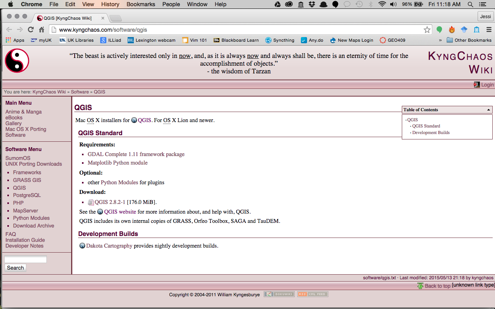   
Figure 02. The King Chaos download page

Another option is to use a virtual machine to run multiple operating systems and experience the full range of open source software. Parallels for Mac OS and Hyper-V on Windows 10 can hosts virtual machines. Popular and free operation systems used in open source mapping include Ubuntu 16.04 and the dedicated mapping platform, [OSGeo virtual machine](https://live.osgeo.org/en/index.html). As a University of Kentucky student, you can [download Windows 10](https://download.uky.edu) and other useful software.

<a name="bugs"></a>
### Bugs

Bugs exist in all versions of QGIS. While the amazing developers who dedicate their time to building QGIS do all they can to make it a seamless application, you will occasionally find certain functionality that doesn't work quite right (and it may depend on the operating system and its version as well). Prepare for this and avoid becoming frustrated, for running into these kinds of technical obstacles is to be expected. To this end, it's not uncommon to revert to another version of the software to complete a particular task or to use an outdated plugin. In fact, as you'll come to learn, a GIS or mapping workflow often involves tinkering with various tools and technologies to work together. Sometimes it might feel like wizardry, but if you experiment enough you'll discover that getting your idea to become a map is very fulfilling.

Note that Windows users can have multiple versions of QGIS installed simultaneously. Mac users will need to uninstall one version before installing another if we want to switch between them.


## Getting Started with QGIS

After you've installed QGIS, launch the application. It will by default open a new blank project file. The QGIS interface is broken down into 5 major sections:

* the **menubar**, where you'll find a number of dropdown menus from which you can access most of the program's features.
* the **toolbar**, this is where your default toolbars and any optional ones you choose to install will live, they provide graphical access to many of the same features accessible through the menubar as well as some that are not in the menubar. Take time and hover over each tool button and see what it does.
* the **Layers Panel**, aka map legend, where you can view and manipulate the various layers within your map (users sometimes close this window accidentally and "lose" their legend, it can be reopened via the menubar by going to **View** > **Panels** and selecting **Layers** from the popup menu)
* the **map view**, where you can view your map.
* the **Browser Panel** is a directory tree, or catalog, of your accessible data.
* the **status bar**, which provides information about the coordinate location of your mouse pointer, the Coordinate Reference System (CRS) of the current map, the scale of the current map view, a rendering progress bar and notifications of the availability of plug-in updates.

For an item by item rundown of the QGIS user interface, consult the [QGIS User Guide](http://docs.qgis.org/2.18/en/docs/user_manual/introduction/qgis_gui.html).

QGIS is going to be your primarily tool in MAP671, and you'll want to spend some time outside of of these modules reading the documentation, opening various datasets you encounter, and getting to know the QGIS interface.

Before we explore how Q operates with some content (a.k.a. data), we're going to cover a few important concepts with regard to mapping and GIS.

## A quick primer on geodesy and spatial reference systems

How do we specify a location on the Earth? The answer to this question turns out to be a surprisingly complex one and involves such mapping/GIS terminology as "geodesy", "projections", "spatial or coordinate reference systems", "datum", "latitude and longitude", and "meridians".

While this module isn't intended to offer an in-depth explanation, we want to gain a working understanding of how space is measured, encoded within our data, and used within QGIS and other mapping processes. For those of you who have worked in GIS for a while, you're already familiar with these concepts. For those of you new to mapping, understand that it is challenging and may take some time to fully understand in both practical and conceptual senses.

To locate geographic features, we use a **spatial reference system (SRS)**, also referred to as a **coordinate reference system (CRS)**. Quoting from the QGIS documentation, a coordinate reference system (CRS) "defines, with the help of coordinates, how the two-dimensional, projected map in your GIS is related to real places on the earth." Spatial references systems also allow us to bring disparate datasets together and line them up atop one another as "layers".

SRSs have a **spatial reference ID (SRID)**, typically a four-digit number that identifies the type of coordinate system a dataset uses. The European Petroleum Survey Group (EPSG) has maintained a catalog of these IDs and often you'll see a coordinate system defined with a "EPSG:" prefix. For example, the CRS used by the GPS navigation system (including your phone) can be defined as "EPSG:4326" which we know as the WGS84 (World Geodetic System, 1984). Other organizations have created projection definitions, e.g., ESRI, and you'll find their prefix with number IDs.

There are two types of these references systems: 1) those which use the center of the Earth as a point of reference for building the system, known as a **geographic coordinate system (GCS)** (sometimes called a "spherical system"), and 2) those which are used to show the earth on flat surface, known as a **projected coordinate system (PCS)** (also referred to as a planar, rectangular, or Cartesian coordinate system). All PCSs contain a GCS, because before we can flatten earth, we need to model its sphere-like shape.

Geographic Coordinate Systems, or spherical systems, divide the globe into horizontal lines known as lines of latitude and consider the equator to be 0 degrees from the center point of origin. You can imagine a line going from the center of the earth to the surface, and as that surface point is moved north away from the equator, the angular measure increases until you reach the pole (90 degrees north). Moving that surface point south is considering a negative degree of latitude, until you reach the south pole (-90 degrees, or 90 degrees S).

We also divide the earth into vertical lines known as lines of longitude or meridians, and there are 360 degrees of these starting at an arbitrary meridian that passes through Greenwich, England known as the [Prime Meridian](https://en.wikipedia.org/wiki/Prime_meridian). We often count degrees of latitude 180 degrees positive (east) and 180 degrees negative (west) from the Prime Meridian.

Together the lines of latitude and longitude form what's known as the graticule and allow us to designate a coordinate pair specifying a point on the surface of the other. The trick with all this is, however, that the Earth is not a perfect sphere, but rather a lumpy ball. So the measurements of latitude and longitude are not exact.

**Geodesy** is the scientific study that measures the shape of earth, and different measurements create slightly different models of the Earth's shape. This is why we need to know which model informed a particular geographic coordinate system. We can also perform transformation of all the coordinate pairs within a dataset to another geographic coordinate system (a fairly common task in GIS processing).


We don't view maps as a round sphere, with the exception of a globe. Rather, we need to flatten out the spherical model onto a flat surface (either a printed map or your computer screen). This involves a process known as map projection. Projections take into account the distortions that occur when you flatten a round(ish) object into a flat surface.

* Read more about [Coordinate Reference Systems](http://docs.qgis.org/2.0/en/docs/gentle_gis_introduction/coordinate_reference_systems.html)

When we use a PCS, we cannot avoid distorting earth, e.g., Google maps depiction of Greenland is a gross distortion of the area of the landmass. We select a PCS based on what we want to preserve on the flat map. Generally, we can preserve true area on a map (equal-area projections) or true shape (conformal projections), but not both simultaneously. A vast array of PCSs have been developed to facilitate mapping anywhere on earth; we just need to look up which SRIDs are appropriate for the location we're mapping (more on this later).

For now, let's remember three takeaways about spatial reference and coordinate systems:

1. GCS's define the shape of Earth and use spherical units of measure (e.g., degrees). PCS's contain a GCS (they need a definition of the shape of earth), are designed to show earth on a 2D plane, and use a linear unit of measure (e.g., most often meters).
2.  In the web mapping world, like CARTO, we generally work in one GCS, WGS84, using latitude and longitude values for coordinates. NAD83 is another GCS that is used.
3. When we make maps in QGIS, we must pick PCS that best suits our scale, area of earth, and measurement goal, e.g., do we want compare area or preserve navigation by showing correct shapes of features.

## Understanding geographic data and data formats

One of the preliminary and most expensive parts of the mapping process is that by which we encode information about the mapped environment. This involves abstracting "real" world phenomena into information. Much of what we're going to learn within MAP671's modules, and the rest of the New Maps Plus curriculum, is about how to take good data and make amazing maps and user experiences with those data. But without interesting information with which to create a geo-visualation application or graphic narrative, the story will often fall flat. Great mapping starts with good, clean data.

Mappers have two predominate "models" for encoding the mapped environment into geographic information: a vector model and a raster model. If you've already done GIS you're familiar with these models. If not, this will quickly become important practical knowledge.

### Vector data

The **vector data model** is composed of points, lines and polygons. Vector data is well suited for representing discrete, homogenous features in the world. For example, a point may represent a bus stop, a line may represent a road, and a polygon may represent a state. Read more about [vector data](http://docs.qgis.org/2.14/en/docs/gentle_gis_introduction/vector_data.html).

How do we encode point, lines, and polygon features within our computer system (and for use over the web)? On a conceptual level, geographic points are encoded as a pair of numerical values (coordinates). Lines are built from points (polylines are a connected sequence of line segments). Polygons are an enclosed set of polylines. These features can have numerous attributes (such as name of a road and area of a state) encoded as an attribute table.

While there are many vector file formats (or specifications), we as web mappers are primarily concerned with three of these: layers in spatial databases, the [Shapefile](https://www.esri.com/library/whitepapers/pdfs/shapefile.pdf), and the [GeoJSON](http://geojson.org/geojson-spec.html). More on these below.

### Raster data

The **raster data model**, by contrast, is composed of a array of gridded cells or pixels. The raster model is best used to represent continuous phenomena, such as air temperature or terrain. Read more about [raster data](http://docs.qgis.org/2.14/en/docs/gentle_gis_introduction/raster_data.html).

While you may be familiar with common image formats used in digital photography such as _.jpeg_, _.gif_, and _.png_ file formats, there are others better suited to geospatial information that encode metadata and other information within the file (such as spatial reference information). For example, the _GeoTIFF_, _NITF_, and _JPEG 2000_ file formats are commonly used in remote sensing analysis.

While we'll be occasionally using raster imagery, the web mapping world is increasingly moving toward vector data. Even the practice of creating raster tiles with map imagery baked into them (first pioneered by Google in 2006) has given way to vector tiles. Mapbox as well is [quickly moving toward vector over raster with their Mapbox GL](https://www.mapbox.com/blog/mapbox-gl-js/). However, satellite, drone, and customer imagery are swelling databases with raster data everyday. Check out the near-realtime imagery from [MODIS satellite](https://worldview.earthdata.nasa.gov/), which can be downloaded and used in QGIS!

## Using vector data within QGIS

We're going to briefly explore three separate sets of geographic data to exemplify both the point/line/polygon composition of the vector data model, as well as to understand the SpatiaLite, Shapefile ,and GeoJSON formats. We'll be exploring how to use raster data in QGIS within a later module.

### Loading and inspecting points, lines, and polygon Shapefiles in QGIS

From the Lesson-01 directory, download the compressed file called _LessonData.zip_ and extract its content. This archive contains vector layers for stream gages, streams, and waterbodies. These three datasets respectively represent points, lines, and polygons. These data show features in Kentucky, Ohio, and Indiana from data downloaded from the [National Map Small-Scale Collection](http://nationalmap.gov/small_scale/). A few other datasets are included to help make a finished map.

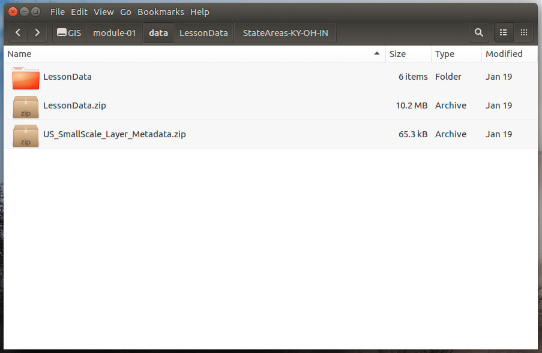   
Figure 03: Lesson data and metadata

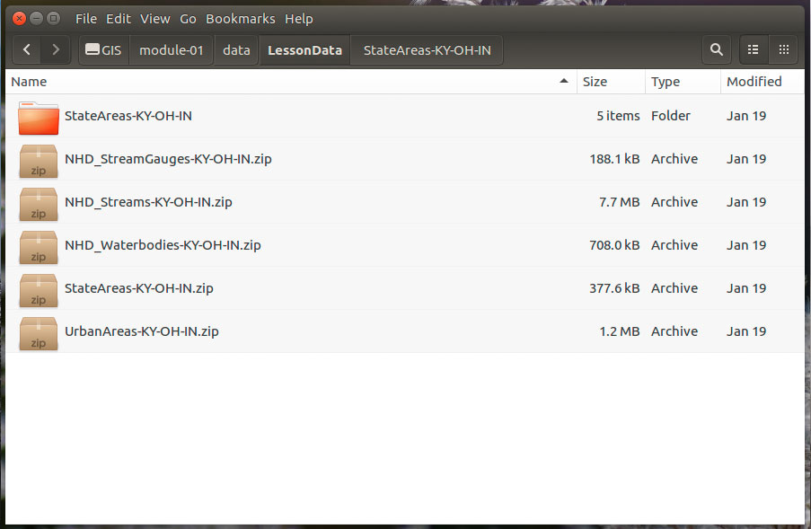   
Figure 04: Five zip files are actually five Shapefile layers

First decompress (a.k.a. "unzip") the _StateAreas-KY-OH-IN.zip_ file, which is a bundled collection of files that comprise the Shapefile multi-file format. Shapefiles are actually composed of at least 3 files, but often more, with a common filename prefix.

Three of these are the mandatory files required for by the Shapefile format:

* _.shp_, the shape format file, which contains the actual geographic data
* _.shx_, the shape index file
* _.dbf_, the attribute file in dBASE format

Note that while the _.shp_ and _.shx_ files are not intended to be human-readable, the _.dbf_ file is a more standardized spreadsheet format and can be open and edited using a program such as OpenOffice Calc.

The other files in the directory are optional files:

* _.prj_, the projection file, which contains the spatial reference and projection information
* _.cpg_, used to specify the character encoding for the _.dbf_ file

There are a handful of [other files associated with Shapefiles](https://en.wikipedia.org/wiki/Shapefile) that you might run into from time to time, and typically we just ignore these files.

All the parts of the Shapefile have to be in the same directory for the file to function, so it is vital to keep your data organized. For instance, in this example, it is better to keep these files in their respective directories (e.g., *StateAreas-KY-OH-IN/*). If you have one Shapefile layer per zipped file, such as found in the _LessonData.zip_, QGIS can read the zipped file as a layer. No need to decompress and it makes handling your data much easier!

Let's take a look at the _.prj_ file. It is a plain text format that can be opened with any text-editing program. [Atom](http://www.atom.io) is a free application for download and use. It is a great tool to have in your toolbox for opening, reading, and writing a variety of text formats and file sizes that other applications struggle with.

Open the _.prj_ file examine the contents:

```
GEOGCS["GCS_North_American_1983",DATUM["D_North_American_1983",SPHEROID["GRS_1980",6378137,298.257222101]],PRIMEM["Greenwich",0],UNIT["Degree",0.017453292519943295]]
```

This information specifies the geographic coordinate and reference systems used to create the data, which QGIS will use when rendering the data within the application and performing any subsequence geoprocessing tasks with the data.

In this case, the important thing to note is Geographic Coordinate System is "GCS_North_American_1983" and the datum is "D_North_American_1983." The **SRID** for this CRS is defined as **EPSG: 4269**.  

Let's now add this Shapefile layer (_StateAreas-KY-OH-IN.shp_) to QGIS. There are variety of ways to open a Vector file in Q:

* select **Layer > Add Layer > Add Vector Layer** from the menubar at the top of the screen and then **Browse** to the specific file within the bundled Shapefiles ending with the _.shp_ or _.zip_ extension
* click on the **Add Vector Layer** icon in the left-hand toolbar and then **Browse** to find that file.
* drag the file with the _.shp_ or _.zip_ extension from the directory into the Q application and drop within the **Layers** panel.

QGIS will display the extent of the features contained within the Shapefile. Ok, add the the remaining layers from the _LessonData_ folder. Now we should see three states and with five other layers.

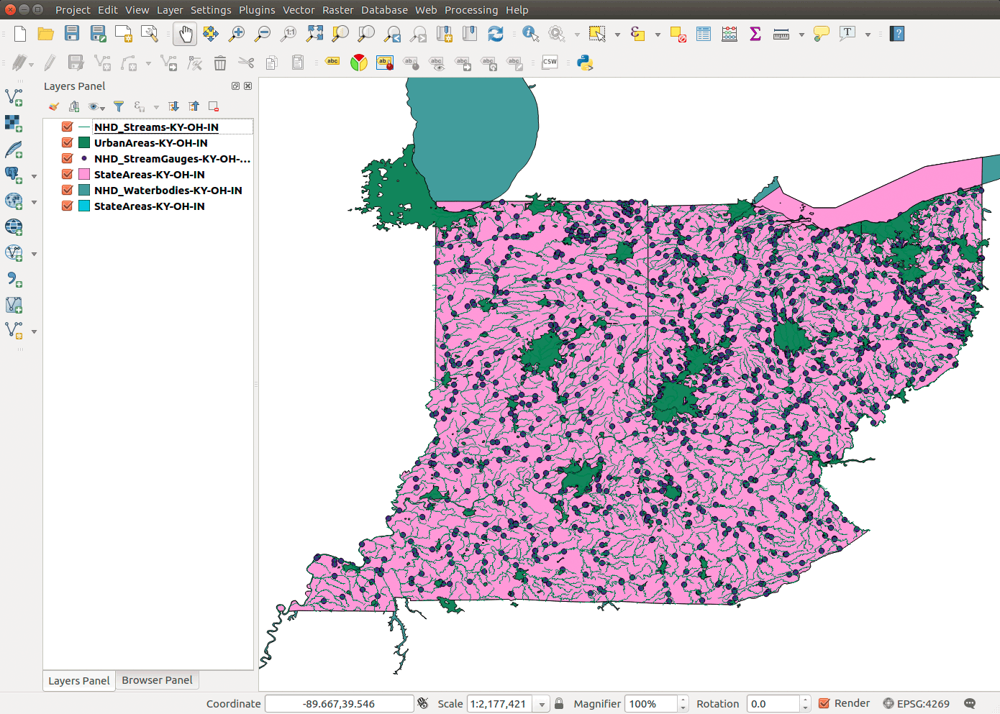   
Figure 05. Six layers for Kentucky, Ohio, and Indiana.

This is a very common task using QGIS in a web mapping workflow. Often we're seeking out appropriate data, or we've been supplied with data with which to map. The first step is often to simply open it in QGIS and have a look at it, both in terms of its spatiality and the associated data attributes. Here we see dots; which is not super interesting.

Next right-click on the **StateAreas-KY-OH-IN** layer and choose **Open Attribute Table**. This is another very common task you'll be repeating throughout this course. We often do this first to inspect the data attributes associated with the vector features. In this case, we can assume the meaning of various data attributes such as the name of the state, the population in 2010, the state FIPS ID, etc. Of course, explore the provided metadata for each layer to understand what these data attributes mean.

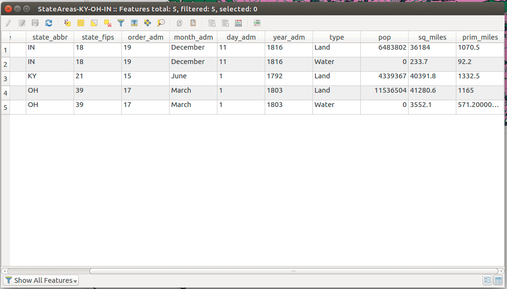  
Figure 06. Inspecting the data attributes of a vector layer

**Save** your QGIS project in the *module-02/lesson-map/* folder now and save often! You should only have one file in this folder with a _.qgs_ file extension.

## Why is Kentucky squashed? Understanding coordinate systems in QGIS

We noted earlier that every spatial layer has a coordinate system. This information is used by a GIS or mapping application to determine how to display the spatial data. Within QGIS, both individual layers and the project as a whole will have a spatial reference setting.

Double-clicking on the **Kentucky state polygon** layer within the **Layers Panel**, or right-clicking and choosing **Properties**, will open up the layer's **Layer Properties** window.

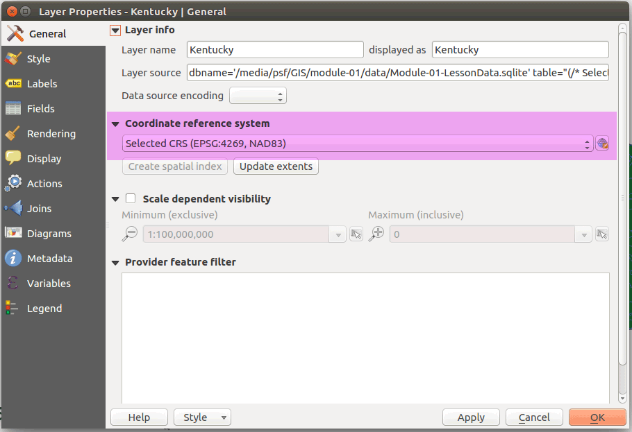   
Figure 07: The coordinate reference system of the layer. NEVER CHANGE IT HERE.

The CRS of this layer is "EPSG: 4269", also called "NAD83", which is a Geographic Coordinate System (GCS) and only defines the shape of the sphere-like earth. It doesn't project the layer to a 2D plane and QGIS has defaulted to a **equirectangular projection**, where lines of longitude and latitude are equally spaced.

Inspect all layers' CRS and find that they are all the same. This is no surprise, since we added them to database with all the same CRS. QGIS can project all of our layers simultaneously to a better representation of local area. "EPSG: 4269" is useful for storing continental-scale datasets and is one of the official CRS used by the federal and state government agencies. It is an "unprojected" CRS  with the idea that the end user will project the data to a CRS appropriate for the area mapped.

### Project all layers 'on the fly'

Click on the **Project menu > Project Properties**. This is where the CRS for the entire project is set. Choose the **CRS** tab (left-hand side). Depending on what your default settings are for QGIS, the project's coordinate reference system may not match with the layer we just imported. Find "EPSG: 3089" CRS, which is the official CRS for Kentucky. Notice the checkbox at the top of the menu box, where is says "Enable 'on the fly' CRS transformation".

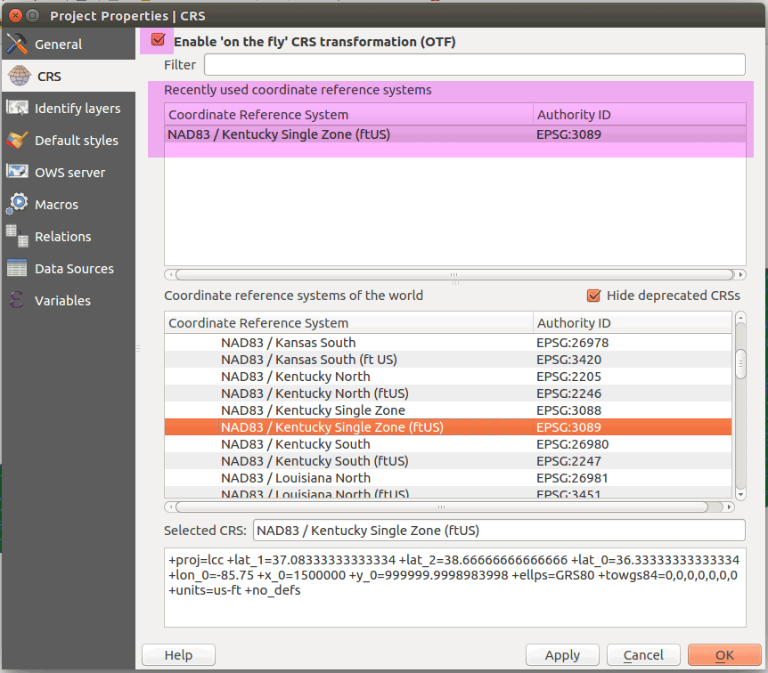   
Figure 08. Project Properties window enable 'on the fly' transformation

When checked, this feature causes all of your layers to appear to be projected in the project CRS regardless of what CRS they're actually projected in. This can be helpful when loading layers with different spatial reference systems. That's right, you don't necessarily need all your layers and project's spatial reference systems to match!

However, if you're doing any spatial analysis (such as using one layer to clip out features from another), the layers have to be in the same CRS (and not just appear to be "on the fly"). We'll cover one way to properly and permanently transform CRSs in the last section.

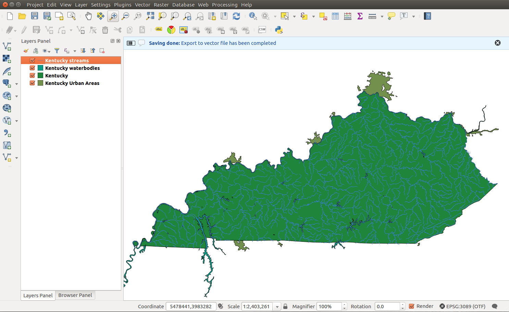    
Figure 09. Layers projected 'on-the-fly' to the EPSG: 3089 CRS.

## Attribute management

Layer symbology often references some value in its attribute table. For example, we could symbolize stream gauges by the volume of average stream flow that it measures or symbolize urban areas by the size of its population. We'll save these type of questions for the next lesson. Or goal here is manage geographic features by their attributes. Often we need to filter or select certain features before we start making a finished map.

### Filtering attributes in the QGIS Layers Panel

While we'll address more robust methods of interrogating your spatial in the next section using DB Manager and SQL, we have an easy and effective way to filter features in QGIS. You can access the **Query Builder** by right-clicking the layer in the **Layers Panel** and selecting the **Filter...**. This presents an dialog where you can execute a **Query**, a properly structured SQL expression that returns features that meet our selection criteria.

The Query Builder interface will create a properly formatted expression if you just click the fields, values, and operators you need. You can test your query before you execute it, which will return the number of matching rows. You cannot delete any data using this filter function so practice away! To help build your expression, attribute fields values can be accessed with the **All** option.

Let's look at some examples. If you wanted to filter only Kentucky urban areas from the layer "UrbanAreas-KY-OH-IN", then we would issue the following query:

```
 "state" = 'KY'
 ```

#### Filtering wildcards

Why don't we have all urban areas in Kentucky? After inspecting the attributes, we find that the ```state``` field has values for urban areas that span multiple states. We need a query that captures all possibilities:

```
"state" LIKE '%KY%'
```
Let's look at the ```LIKE``` operator and the ```%``` and ```_``` wildcards in the above expression. The ```LIKE``` operator does pattern matching and the ```%``` wildcard will match anything before or after 'KY'. The ```_``` wildcard matches any single character. Some examples will clarify how this works.
```
LIKE '_Him_'
```

matches 'sHim', 'SHimd', and 'Him', but not 'him'.

```
LIKE '%olo%'
```

matches 'Rolo time after dinner', 'how was that rolo', and 'olo' but not 'old'.

We have other options to selecting features. The ```In``` operator allows us to select multiple values explicitly:

```
"state" in ('KY','KY-IN','KY-OH-IN')
```
The Query Builder uses common operators in the Structured Query Language (SQL) ```Where``` clause expression. You can learn more about these operators and experiment with them on the [W3Schools SQL tutorial](https://www.w3schools.com/SQl/sql_where.asp). If you want more exposure to SQL, you can explore the following sections on spatial databases.

Finally, let's filter all of our layers to show only Kentucky features:

    
Figure 10: Three map layers in QGIS Map Canvas


### Spatial databases and the DB Manager


<p style="padding:20px;background-color:#ffd9fe;">In many modules we present how to do analysis with SQL in spatial databases, though we show how to accomplish the same analysis through other methods in QGIS. For example, the following section explores how to filter data. While we can perform the same analysis without SQL, the advantages of learning of how to work in spatial databases are numerous, e.g., creating instructions that can reproduce our workflow. We will discuss more advantages as we move through the modules.  </p>


If you opened the attribute tables for all layers, you should appreciate how much information is provided here. To manage this data, we will use a PostGIS database and add these layers. Essentially we are importing many Shapefiles into a single database. What are the advantages of this?

While Shapefiles are widely used and a de facto standard, they are a legacy data format. Let's point out a few problems with the Shapefile.

* A Shapefile is a multi-file format and hard to manage without a GIS application, e.g., imagine renaming a Shapefile in your OS finder or explorer. A Shapefile requires at least three files, but over the years many other files have been 'glued on.' Now imagine a project with a dozen layers to manage!
* The _.dbf_ dBASE file has serious constraints and hard to edit outside of a GIS application (in fact few other apps use a _.dbf_ file). Field names are limited to 10 characters and field data types are are only text, integer, and float (but you need to specify how many decimal points).

Our workflow will be to convert the Shapefile to a more useful format. We'll focus on two formats; the spatial database and the GeoJSON format. We'll explore the latter format in more detail in our last section.

#### Open source spatial databases

A spatial database stores geometry in a table and provides spatial functions to analyze and process that geometry. In the open source world, we have two popular spatial databases, [PostGIS](http://www.postgis.net/) and [SpatiaLite](https://www.gaia-gis.it/fossil/libspatialite/index). Both share the [GEOS Library](https://trac.osgeo.org/geos/) (Geometry Engine, Open Source) to do spatial functions, like calculate areas of polygons and intersecting layers based on spatial proximity. They both use SQL (Structured Query Language) to access these functions and other data management operations, which can be scripted, shared, and reused as plain text files.

While we call these spatial databases PostGIS and SpatiaLite, they are actually extensions to popular open source databases. PostGIS extends [PostgreSQL](https://www.postgresql.org/) and SpatiaLite extends [SQLite](http://www.sqlite.org/). While both databases are free and open source software, full-featured, share the same functions, and are natively supported in QGIS, we have some notable differences.

* **PostGIS/PostgreSQL** is the preferred spatial database, but it is more difficult to install and setup, server-based (requires a service to continuously run on a computer), and not as portable. That said, if you want to work on big data, you will gain a lot of great experience installing and running this spatial database. PostGIS supports the raster data type and analysis.

* **SpatiaLite/SQLite** is a server-less file-based format that is easily shared and doesn't require any additional software installation. SpatiaLite is not maintained and updated as well as PostGIS, so it will only be used as a format to share vector and tabular data. SpatiaLite does not support raster data.

#### Install PostGIS and connect to database

Follow the instructions in this short tutorial to install a PostgreSQL database with the PostGIS extension: [Installation instructions](spatial-database-setup.md). After you install the database and connect to it, you can begin adding data. We now need to launch QGIS's DB Manager.

### QGIS's DB Manager

The main tool we'll use to manage our databases is QGIS's DB Manager, but we can also use [PgAdmin](https://www.pgadmin.org) to access our data. DB Manager is convenient since we can add spatial data directly to our Map Canvas. Later in the course when we visit CARTO online mapping, we will use the same SQL on CARTO's database.

Find the manager in **QGIS's menu > Database > DB Manager** and click to open. You'll find four types of data that can be connected in DB Manager.

* **Geopackage** is relatively new open source standard based on SQLite database container, can store many types of data (raster, vector, other project files), and is designed to share with other GIS platforms, like ESRI's ArcGIS. We're excited to start using this format but we really haven't seen it too much yet.
*  **PostGIS** connected databases. Expand it and you should your recently created database.
*  **SpatiaLite** connected databases.
*  **Virtual Layers** are layers in QGIS's **Layers Panel** that we added in the current session.

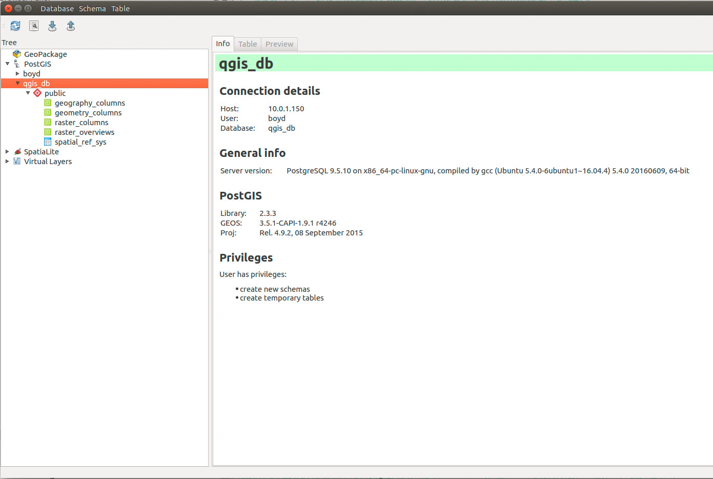  
Figure 11. Fresh PostGIS database tables

Every new database has a few system resources included by default. Expand your new database and let's inspect what we have.

* Four **columns and overviews** which are database views (a virtual table or query) that PostGIS adds to help the client, QGIS DB Manager, work with spatial objects.
* **spatial_ref_sys** is a metadata table that defines SRID coordinate systems using the **PROJ** library. If the library doesn't have a desired CRS, we can add it to this table.

Select the **Info** tab for your database. It provides useful information for your database, like the name and location, database version, and the included libraries supporting the spatial database, i.e. GEOS and PROJ. If you select tables in your database, you can get details like number of rows, fields, and data types of fields. We have no spatial data in our database, so let's add some to our public schema.

<a name="add-data-to-db-manager"></a>
#### Add data to DB Manager

Make sure you have layers in your QGIS's **Layers Panel**.

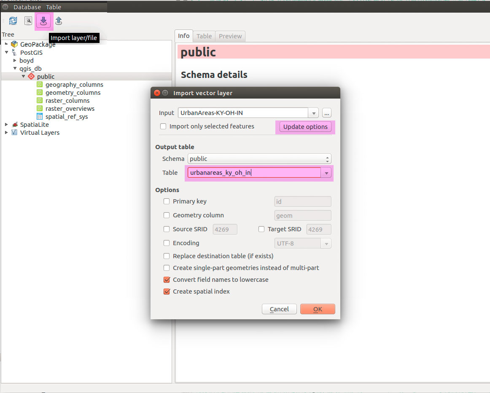  
Figure 12. Add data to database and ay close attention to these settings!

Click the **Import Layer** button and select your streams layer. We'll repeat this for each layer, but we need to aware of settings the import utility  presents us.

1. Click the **Update options** to propagate the default settings for the geometry field, unique ID field, and SRID.
2. Rename the table in **Output table > table** field. Use only lowercase letters, underscores, no spaces, and do not start a table name with a number. This will allow to call the table name without using quotes.
3. Click on the options to **Create spatial index** and **Convert field names to lowercase**.

After you select the layer you want to import, click the **Update options** which will populate the import parameters with correct default settings. Let's take a look at each parameter.

* The **Schema** is the folder or logical space you want to store your data. Schemas can include rules of how data is managed. We can create a schemas, but just use the **public** schema now.
* **Output table** provides us the name of table (layer) in our database.
* **Primary key** provides the default name, "id," that uniquely identifies with an integer number for each record in the table.
* **Geometry column** provides the default name, "geom," that stores the geometry for each feature.
* **Source SRID** defines the coordinate system of the incoming layer. We should never change this number!
* **Target SRID** defines the coordinate system of the new layer in our database. We often will change this depending on what scale we are mapping and the purpose of project. We'll discuss this later.
* **Encoding** allows us to change the default encoding of our text data (how characters are defined and stored). UTF-8 is the standard.
* **Replace destination table (if exists)** will allow us to overwrite existing tables and is good for managing databases.
* **Create single-part geometries instead of multi-part** will break multi-part features into separate records and copy their field values into the new records. Imagine Hawaii as a single record in a database with fields for total area of state and population. If we break this into single-part geometries, every island will be a new record with the same attributes for area and population. This could certainly add confusion in the resulting table.
* **Convert field names to lowercase** makes it easier to build SQL. Any table or field name that contains an uppercase letter needs to be wrapped in quotes.
* **Create spatial index** should be enabled and will accelerate the speed of querying features, but might slow import.

Click **OK** and repeat for the remaining layers. After you finished your data import, right+click your database and **Re-connect** to refresh your tables. If you click **Remove** you'll remove the connection in QGIS, but not the database. If you accidentally remove your database, just right+click **PostGIS** to **Add new connection** and navigate to the database you created earlier.

Explore your database and inspect your tables. Notice the unique icons for your different geometry types. The **Info**, **Table**, and **Preview** tabs provide useful information and should be fairly easy to understand.

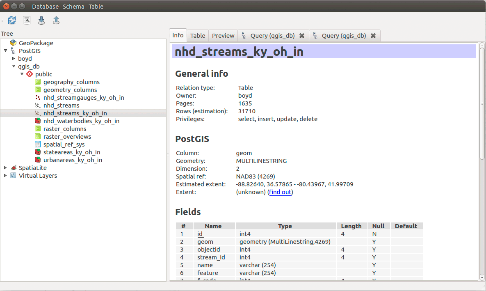   
Figure 13: Inspect your database tables

What can be deleted? The duplicate Shapefiles! If your database works, the Shapefiles are redundant and can be removed. Also remove them from the QGIS **Layers Panel**. Keep the metadata, though, since it's still useful.

### Example SQL statements for this lesson

Before we start executing SQL, let's find example statements we can use during the lesson. If you've managed to use the same table names, you should be able to copy these statements and paste them into DB Manager. They should run as expected since they are just instructions. That's a benefit of using SQL.

Find *lesson-02.sql* in module repository that has all of the below .


### SQL in the DB Manager

Let's say we're going to make a map of Kentucky hydrography and urban areas. How can we prep the data in DB Manager before we add them to the **Layer Panel**? For example, we need to select just data for Kentucky and use pertinent attributes to style our layers.

We will discover that we can use SQL (Structure Query Language) to perform a lot of useful tasks in DB Manager. While this course is not a class in SQL coding, we will learn by example executing SQL on our databases. Consult this [SQL reference and tutorial](http://www.w3schools.com/sql/default.asp) to experiment with our SQL examples.

Let's launch the **SQL window**, the second button from the left in DB Manager. It doesn't matter which table you have selected; we can access all tables in a database from the SQL window.

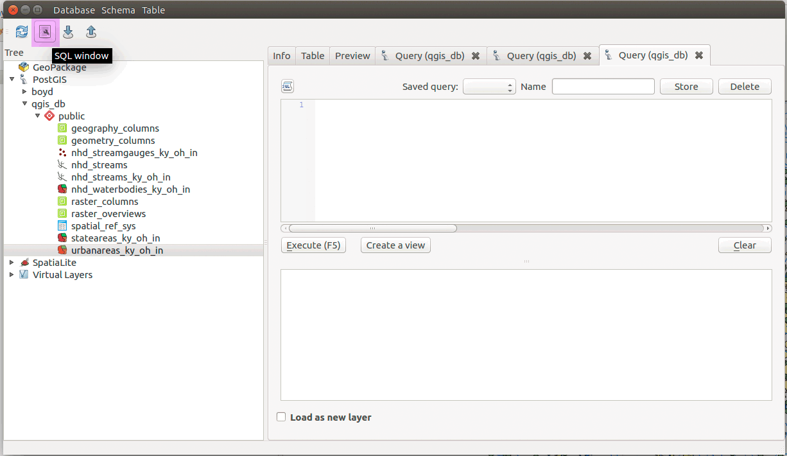   
Figure 14: SQL window

This is the default SQL window where we can interrogate our data. Notice that we can **Store** queries, but they are only saved during this session. They are deleted once we close QGIS. Please use your *Atom* code editor to save your effective queries.

A **Query** is a properly structured **SQL Statement** that acts on our data. The most basic query is to return all records and columns in a table:

```
select
	*
from
	urbanareas_ky_oh_in
```    

Use this query in your SQL window and hit **Execute**.

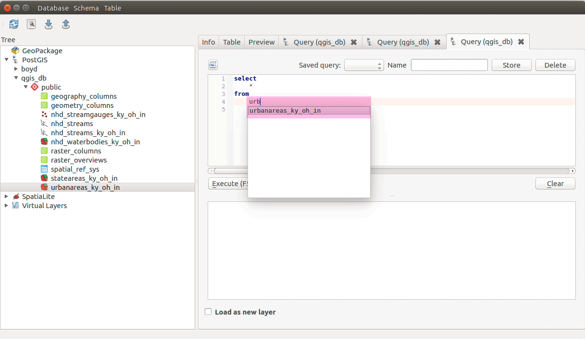   
Figure 15: SQL query to select all records and columns. Note the autocomplete for table names!

You should see all records and columns returned in the DB Manager's second window. This is a selection of our data and we could add it to QGIS **Map Canvas** as a Virtual Layer or create new data from the query. Let's explore some more SQL to manage our data before we start mapping.

A few notes about syntax.

* PostGIS table and field names can use double quotes. If they have dashes or capitalized characters, they must use double quotes.
* Alphanumeric field values are case sensitive, e.g, 'Kentucky' doesn't equal 'KENTUCKY', and must be enclosed in single quotes.
*  SQL commands are case insensitive and we can use spaces, tabs, and comment lines to format our queries to make them easier to read. The statement below is nicely formatted with comments:

```
/* Comments are good to add */

/* Query to select all records and columns */

select  
	*
from
	urbanareas_ky_oh_in --table name without quotes (yes, another comment!)
	-- table name with quotes "urbanareas_ky_oh_in" and both are correct!
```

OK, let's explore some queries to inspect and sort our data. You should be able to copy and paste these statements if your table name matches mine. The goal of the SQL statement will be given in a comment line.

```
/* Sort table by city name, descending */

select
	*
from
	urbanareas_ky_oh_in
order by
	"ua_label" DESC -- sort by name
```
Try swapping ```DESC``` with ```ASC``` for alphabetically sorting table. ```ASC``` is default sort method.

```
/* Sort table by city name in Kentucky */

select
	*
from
	urbanareas_ky_oh_in
where
	"state" = 'KY'
order by
	"ua_label"

```
In most cases, we don't need all columns in our output table. With SQL we can specify which column we want in the output table. This will certainly help keep our data 'slim and trim' for easier management both for cartography and for online sharing.

```
/* Sort table by city name in Kentucky and return only columns we want to map */

select
	/* select columns for output table */
	id, 						
	geom,
	state,
	ua_label as "City_Name",
	/* change column names in output table with the "AS" operator */
	gis_acres
from
	urbanareas_ky_oh_in
where
	"state" = 'KY'
order by
	"ua_label"

```

#### Field data types

In PostgreSQL, data types are [numerous](https://www.postgresql.org/docs/9.6/static/datatype.html). In general we use the following types most:

* **Integer** values contain only whole numbers.
* **Text** values contain alphanumeric characters, maybe all numbers, and don't have any length restrictions, e.g.,number of characters.
* **Numeric** values are numbers with ratios and are exact values, unlike the _real_ type in PostgreSQL.

The reason there are so many types is to maintain performance on massive databases. For example, the _real_ number data type has less precision than _float_ or _numeric_ but requires less database storage space. If we don't need that detail, then don't build it into the database.

#### CAST to other data types

Our databases will manage our data types pretty well, though sometimes we have small problems in our input data that we need to address. Let's sort by size of urban area as given by the _gis_acres_ field. Switch back to the **Info** tab for this layer and notice the data type for this field is _TEXT_. This _TEXT_ field will prevent us from correctly sorting our table. Try out the following SQL add see what happens:

```
/* Sort table by gis_acres in Kentucky and return only columns we want to map */

select
	/* select columns for output table */
	id, 						
	geom,
	state,
	ua_label as "City_Name",
	/* change column names in output table with the "AS" operator */
	gis_acres
from
	urbanareas_ky_oh_in
where
	"state" = 'KY'
order by
	gis_acres
```
It sorted alphabetically (e.g., 11 comes before 9), not smallest to largest value! Our database has many functions to alter our data during a ```SELECT```. Let's use the ```CAST``` function to cast our data to a desired type.

The ```CAST``` requires a field name, and ```AS``` operator, and data type.

Execute the following SQL:

```
/* Sort table by gis_acres in Kentucky and return only columns we want to map */
select
	/* select columns for output table */
	id, 						
	geom,
	state,
	ua_label as "City_Name",
	/* change column names in output table with the "AS" operator */

	cast(gis_acres as real) as "Acres"
	/* the cast function changes a field data type */
from
	urbanareas_ky_oh_in
where
	"state" = 'KY'
order by
	"Acres" DESC
	/* had to change the order by field name because the cast field name was changed */
	/* The largest city in Kentucky is Louisville. Is it in this list? */
```

Alternatively we could use the double-colon "::" switch to cast data type. The above query can be written as:

```
/* Sort table by gis_acres in Kentucky and return only columns we want to map */
select
	/* select columns for output table */
	id, 						
	geom,
	state,
	ua_label as "City_Name",
	/* change column names in output table with the "AS" operator */

	gis_acres::numeric as "Acres"
	/* the cast function changes a field data type */
from
	urbanareas_ky_oh_in
where
	"state" = 'KY'
order by
	"Acres" DESC
	/* had to change the order by field name because the cast field name was changed */
	/* The largest city in Kentucky is Louisville. Is it in this list? */
```

#### WHERE clause wildcards

We all know Louisville (Kentucky Derby and Fried Chicken!) but does it show up in our results? Why not? The ```WHERE``` clause selects only records where the column "state" is exactly 'KY'. Of the three largest cities in Kentucky, two sprawl into other states. Louisville is actually in 'KY-IN'. How can we make a ```WHERE``` clause that selects records with 'KY' and any other state in the name? Let's look at the ```LIKE``` operator and the ```%``` and ```_``` wildcards in the following statement:

```
WHERE "state" LIKE '%KY%'
```
The ```LIKE``` operator does pattern matching and the ```%``` wildcard will match anything before or after 'KY'. The ```_``` wildcard matches any single character. Some examples will clarify how this works.

```
LIKE '_Him_'
```
matches 'sHim', 'SHimd', and 'Him', but not 'him'.
```
LIKE '%olo%'
```
matches 'Rolo time after dinner', 'how was that rolo', and 'olo' but not 'old'.

OK, one last query before we start adding layers to our map.

```
/* Sort table by gis_acres for largest urban areas in Kentucky
and include those urban areas that span into other states. */

select
	/* select columns for output table */
	id, 						
	geom,
	state,
	ua_label as "City_Name",
	/* change column names in output table with the "AS" operator */

	cast(gis_acres as real) as "Acres"
	/* the cast function changes a field data type */
from
	urbanareas_ky_oh_in
where
	"state" like '%KY%'
	/* include urban areas that extend into other states */
order by
	"Acres" DESC
	/* had to change the order by field name because the cast field name was changed */
	/* The largest city in Kentucky is Louisville. Is it in this list? */
```

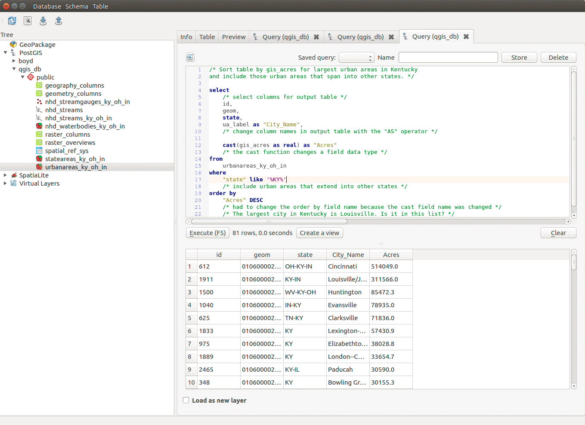    
Figure 16: Output table from above query

<a name="use-a-code-editor-to-save-and-edit-your-sql"></a>
### Use Atom text editor to save and edit your SQL

As you can see, we have a lot of functionality with simple text. As we journey through New Maps Plus and online mapping, we'll use more code to produce content. Save your queries as _.sql_ text files inside your repo.

### Exporting SQL query tables as layers in Map Canvas

In DB Manager we can save our successful queries to QGIS's Map Canvas in two ways:

* **Load as new layer** will create a Virtual Layer in Map Canvas. This does not modify your database. The only settings you need to change are the **Layer name**  (can have spaces, dashes, and mixed case) and selecting the ```id``` and ```geom``` columns. These need to be available for mapping.

   
Figure 17: Load a new layer into QGIS Map Canvas

* **Create a view** modifies the database by adding a new table view. It is the button to the right of the **Execute** button. You give your query a **View name** (cannot contain spaces, capitalized characters, or dashes). Views are stored queries and are dynamically produced when you connect to the database.

* Use the SQL clause ```create table new_table_name as``` the result of a ```select``` statement. This produces a new table in your database. This is the easiest way to create new data, but you'll need to give meaningful names to your tables and remove bad queries. Otherwise, you'll have a cluttered database. For example the following query creates a new state polygon layer for Kentucky:

```
/* Select Kentucky state polygon with population and square miles*/

create table
	kentucky_urban_areas
as

select
	id, 						
	geom,
	state,
	ua_label as "City_Name",
	cast(gis_acres as real) as "Acres"
from
	urbanareas_ky_oh_in
where
	"state" like '%KY%'
order by
	"Acres" DESC
```

After you **execute** this query you likely not see any dramatic changes. Right-click on the database name and select **re-connect** to refresh your database contents. You should see a layer called *kentucky_urban_areas*.

This is an easy step to produce a new layer. However, we should designate the unique filed `id` as the primary key. This ensures that each record has a unique identifier. This will be important when we start analysis.

```
alter table
		kentucky_urban_areas
add primary key (id);
```

Double-click the layer name to add it to the Map Canvas.

#### Create three more layers

Let's create data for waterways and urban areas for Kentucky. We'll build some SQL statements to extract what only what we need for final cartography. Here are the layers we will query:

* nhd_waterbodies_ky_oh_in
* stateareas_ky_oh_in
* nhd_streams_ky_oh_in

<a name="selecting-kentucky-state-polygon"></a>
#### Selecting Kentucky state polygon

```
/* Select Kentucky state polygon with population and square miles*/

select
	/* select columns for output table */
	id, 						
	geom,
	name,
	pop,
	sq_miles
from
	stateareas_ky_oh_in
where
	"name" = 'Kentucky'

```
If you have a successful query, then either **Load as a new layer** or use the `create table new_table_name` to create the layer. Remember to double-click the database layer to add it to your Map Canvas.

<a name="selecting-kentucky-waterbodies"></a>
#### Selecting Kentucky waterbodies

```
/* Select Kentucky waterbodies, which are lakes, swamps, and large rivers*/

select
	/* select columns for output table */
	id, 						
	geom,
	state,
	name,
	feature,
	area_sq_mi
from
	nhd_waterbodies_ky_oh_in
where
	"state" like '%KY%'
	/* rivers can span two states */

```
If you have a successful query, then either **Load as a new layer** or use the `create table new_table_name` to create the layer. Remember to double-click the database layer to add it to your Map Canvas.

<a name="selecting-kentucky-streams"></a>
#### Selecting Kentucky streams

```
select
	/* select columns for output table */
	id, 						
	geom,
	state,
	name,
	feature,
	length_mi,
	strahler as stream_order
	/* Column showing size of stream */
from
	nhd_streams_ky_oh_in
where
	"state" like '%KY%'
	/* rivers can span two states */
and
	strahler > -999
	/* Use the "AND" operator to get streams in Kentucky and are on the stream network */
order by
	strahler DESC

```
If you have a successful query, then either **Load as a new layer** or use the `create table new_table_name` to create the layer. Remember to double-click the database layer to add it to your Map Canvas.

This last query was based on the Metadata provided with this data. In the ```NHD_Streams.txt``` we find this definition of the attribute "Strahler":

```
Attribute:
        Attribute_Label: Strahler
        Attribute_Definition:
			A number representing the order of the stream
			using the Strahler stream-order classification system,
			in which first-order streams have no tributaries,
			second-order streams begin at the  confluence of two first
			order streams, third-order streams begin at the confluence
			of two second-order streams and so on.  If a lower-order
			stream flows into a higher-order stream, the stream
			order of the higher-order stream does not increase.
        Attribute_Definition_Source: Dingman, S.L., 2002, Physical Hydrology, 2nd Ed.
       Attribute_Domain_Values:
          Range_Domain:
            Range_Domain_Minimum: 1
            Range_Domain_Maximum: 7
        Attribute_Domain_Values:
          Enumerated_Domain:
            Enumerated_Domain_Value: -998
            Enumerated_Domain_Value_Definition:
              The feature is not part of the stream network and is outside the coastline.
            Enumerated_Domain_Value_Definition_Source: National Atlas of the United States
        Attribute_Domain_Values:
          Enumerated_Domain:
            Enumerated_Domain_Value: -999
            Enumerated_Domain_Value_Definition:
              The feature is not part of the stream network and is inside the coastline.
            Enumerated_Domain_Value_Definition_Source: National Atlas of the United States

```
If you have four layers in QGIS's map canvas like shown below, you can close **DB Manager**. It's time to export data!

## Converting layers to GeoJSON format with a projection transformation

Let's say that now we wish to export or copy spatial layers into a format more suitable for a web mapping. We use the GeoJSON format. GeoJSON is a widely embraced open interchange format for encoding geographic data (points, lines, polygons) and used within such mapping libraries as [Mapbox.js](https://www.mapbox.com), [Leaflet](http://leafletjs.com/), [CARTO](https://CARTO.com), [Data Driven Documents (D3)](http://d3js.org/). GeoJSON is a convenient way to store your spatial data within a single text file and used it within QGIS or a web map.

The GeoJSON has additional advantages over the Shapefile format. The GeoJSON format can store multiple vector geometry types in one file (e.g., point and polygon in the same file but Shapefiles can store only one type of geometry in a file). GeoJSON is readable/editable with a plain text editor, e.g. such as in Atom. GeoJSON can have long field names, but Shapefiles have a 10-character limit as noted earlier.


When we convert to a GeoJSON, we can permanently transform the data's spatial reference information from the current GCS_North_American_1983, i.e., NAD83, to one more common in the web mapping environment: WGS84.

To perform the data conversion and spatial reference transformation:

* Right-click on each layer (we'll do the _Kentucky streams_ layer) and choose **Save As...**.
* Change the format to **GeoJSON**.
* Click the **Browse** button to navigate to your data directory and provide a name for the new file. We'll give it the same name, and the file will be saved as _Kentucky_streams.geojson_.
* Change the **CRS** to "EPSG:4326 - WGS84"
* Scroll down within the window to find the **COORDINATE_PRECISION** field underneath **Layer options** and adjust this number to 4 (the default coordinate precision value of 15 is unnecessary and bloats the size of our file).
* Disable the **Add saved file to map** option checked and click **OK**
* Note that you can omit unnecessary fields via the option **Select fields to export and their export options** to further reduce the size of the GeoJSON. Generally, when we create a GeoJSON for web mapping, we want to reduce the size of the file so that it downloads quicker. The easiest methods to reduce the size of a GeoJSON is reducing the coordinate precision and removing fields that are not used in the web map, e.g., will the field inform a popup window?


QGIS then performs the format conversion as well as the projection transformation. This method is primary way we both permanently change the CRS of a layer and covert it to a new layer. The other way to perform a CRS transformation is when import (and export) layers to a spatial database.

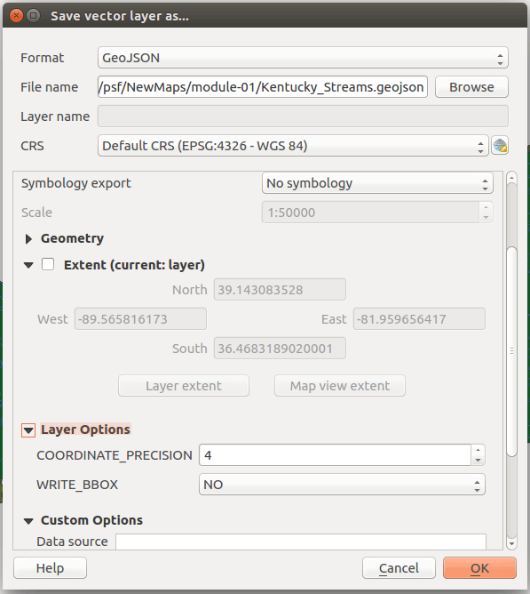  
Figure 18. Save vector layer as...

To briefly introduce the GeoJSON format, examine the file produced by QGIS in your folder/directory structure. The beautiful part of the GeoJSON format, compared to other formats, is that it is a single, plain text file. Go ahead and open it up in your text Attribute_Definition_Source.


While it's not initially a reading-friendly collection of text, careful examination of it's contents reveal a simple standard encoding all the geographic features. We can see, for instance, the file encodes the output spatial reference information we specified in QGIS (_"crs": { "type": "name", "properties": { "name": "urn:ogc:def:crs:OGC:1.3:CRS84" } },_), as well as the data attribute information encoded as key/value pairs that we saw earlier within the Attribute Table.

Before submitting a GeoJSON, load the file into [http://geojson.io](http://geojson.io). If it looks correct on this site, then you have a properly formatted GeoJSON.

<a name="editing-geojson-layers"></a>
### Editing GeoJSON layers

If you're using QGIS on Windows or Mac OS you can now edit GeoJSON layers, such as adding fields new fields or geometric objects. When create a GeoJSON, you do not need to reduce the coordinate precision. You should change the CRS to a local coordinate system, e.g., in Kentucky we would use "EPSG: 3089".


## Resources and references

* [QGIS Documentation](https://www.qgis.org/en/docs/index.html)
* [A Gentle Introduction to GIS](http://docs.qgis.org/2.14/en/docs/gentle_gis_introduction/)
* [Mapbox](https://www.mapbox.com/)
* [CARTO](https://CARTO.com)
* [ArcGIS](https://www.arcgis.com/features/)
* [Shapefile format in a white paper](https://www.esri.com/library/whitepapers/pdfs/Shapefile.pdf)
* [Open Source Geospatial Foundation](http://www.osgeo.org/)
* [27 Differences Between ArcGIS and QGIS – The Most Epic GIS Software Battle in GIS History](http://gisgeography.com/qgis-arcgis-differences/)
* [QGIS User guide](http://docs.qgis.org/2.14/en/docs/user_manual)
* [QGIS Training manual](http://docs.qgis.org/2.14/en/docs/training_manual/)
* [Available QGIS plugins](https://plugins.qgis.org/plugins/)
* [https://www.python.org/](https://www.python.org/)
* [QGIS.org](http://www.qgis.org/en/site/)
* [QGIS download page](https://www.qgis.org/en/site/forusers/download.html)
* [Brackets](http://brackets.io)
* [KyngChaos QGIS download](http://www.kyngchaos.com/software/qgis)
* [SQL Reference](http://www.w3schools.com/Sql/sql_quickref.asp)
* [SpatiaLite Reference](https://www.gaia-gis.it/gaia-sins/spatialite-sql-4.3.0.html)
* [QGIS User Guide](http://docs.qgis.org/2.14/en/docs/user_manual/introduction/qgis_gui.html)
* [Coordinate Reference Systems](http://docs.qgis.org/2.14/en/docs/gentle_gis_introduction/coordinate_reference_systems.html)
* [vector data](http://docs.qgis.org/2.14/en/docs/gentle_gis_introduction/vector_data.html)
* [raster data](http://docs.qgis.org/2.14/en/docs/gentle_gis_introduction/raster_data.html)
* [National Map Small-Scale Collection](http://nationalmap.gov/small_scale/)
